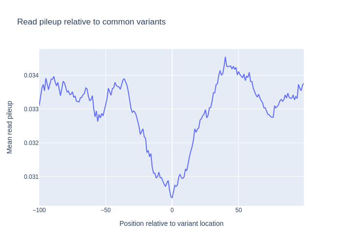

.. _multi_genomic_data:

==============
 Genomic Data
==============
This tutorial assumes that you have read Genomic Data introduction and will cover some use-cases where several data sources are used.

TSS-plot
========
Here we want to see how the signal from a chip-seq experiment looks around the transcription start sites. In order to do this, we use a wig file from ENCODE, (converted from bigwig by using bigWigToWig), and an annotation file for the reference genome (`.gtf`). Note that since the `wig` file is very big, we cannot fit it into memory at once, so we have to read it as a stream. This also means that the chromosome order needs to be adapted to the order in the wig file, which in this case is alphabetically sorted. We therefore give the `sort_names=True` option to the `Genome` object. In addition, we have to call `bnp.compute` on the resulting mean signal in order to actually compute it (When data is read as a stream, all computations on that data is lazily evaluated)

.. testcode::

    import numpy as np
    import bionumpy as bnp
    import plotly.graph_objects as go
    
    def tss_plot(wig_filename: str, chrom_sizes_filename: str, annotation_filename: str):
        # Read genome and transcripts
        genome = bnp.Genome.from_file(chrom_sizes_filename, sort_names=True) # The wig file is alphbetically sorted
        annotation = genome.read_annotation(annotation_filename)
        transcripts = annotation.transcripts
    
        # Get transcript start locations and make windows around them
        tss = transcripts.get_location('start').sorted() # Make sure the transcripts are sorted alphabetically
        windows = tss.get_windows(flank=500)
    
        # Get mean read pileup within these windows and plot
        track = genome.read_track(wig_filename, stream=True)
        signals = track[windows]
        mean_signal = signals.mean(axis=0)
        signal = bnp.compute(mean_signal)  # Compute the actual value
        px.line(x=np.arange(-500, 500), y=signal.to_array(),
                title="Read pileup relative to TSS start",
                labels={"x": "Position relative to TSS start", "y": "Mean read pileup"}).show()

If we run this with chip-seq signal from a CTCF-transcription factor signal we get the follwoing signal.

.. image:: ../figures/tss_plot_ENCFF994MIH.png

Variant pileup
==============

It's interresting to also see, how the read pileups look around common variants. To do this, we make a similar plot around the locations in a vcf file. In this case, the vcf file has doesnt have  the 'chr' prefix in their chromosome names, i.e ('2' instead of 'chr2'), so we specify the `has_numeric_chromosomes` flag when creating genomic locations. Instead of using the p-value scores, we here create a pileup directly from the `bam` file.

.. testcode::

    def vcf_plot(wig_filename: str, chrom_sizes_filename: str, vcf_filename: str):
        # Read genome and variants
        genome = bnp.Genome.from_file(chrom_sizes_filename)
        variants = genome.read_locations(vcf_filename, has_numeric_chromosomes=True)
    
        # Get windows around variants and get read pileup in these windows
        flank = 100
        windows = variants.get_windows(flank=flank)
        reads = genome.read_intervals(wig_filename, stream=True, stranded=True)
        track = reads.get_pileup()
        signals = track[windows]
    
        # Get mean signal inside these windows and plot
        mean_signal = signals.mean(axis=0)
        signal = bnp.compute(mean_signal)
        signal = signal.to_array()
    
        px.line(x=np.arange(-flank, flank), y=signal,
                title="Read pileup relative to common variants",
                labels={"x": "Position relative to variant location", "y": "Mean read pileup"}).show()

Summit plot
===========
It's useful to see how the reads align on both sides of the summits we find from peak calling. In order to do this, we create one pileup from reads on the negative strand, and one for the positive strand, and we see how these look around the peak summits:

.. testcode::

    def summit_plot(bam_filename: str, chrom_sizes_filename: str, peak_filename: str, plot=True):
        # Read genome and peaks
        genome = bnp.Genome.from_file(chrom_sizes_filename).with_ignored_added(['chrEBV'])
        peaks = bnp.open(peak_filename, buffer_type=bnp.NarrowPeakBuffer).read()
        location_entries = bnp.LocationEntry(peaks.chromosome, peaks.start+peaks.summit)
        # Create locations of peaks summits
        summits = genome.get_locations(location_entries).sorted()
    
        # Create windows around summits and extract read pileup
        windows = summits.get_windows(flank=200)
        reads = genome.read_intervals(bam_filename, stream=False, stranded=True)
    
        # Get mean pileup for reads with negative and positive strand
        signals_dict = {strand: reads[reads.strand == strand].get_pileup()[windows].mean(axis=0)
                        for strand in '+-'}
        signals_dict = bnp.compute(signals_dict)
        go.Figure(
                  [go.Scatter(x=np.arange(-200, 200), y=signal.to_array(), name=f'{strand} Strand')
                   for strand, signal in signals_dict.items()],
                  layout={'title': 'Summit plot',
                          'xaxis_title': 'Distance from peak summit',
                          'yaxis_title': 'Read coverage'}).show()

.. image:: ../figures/summit_plot.png
